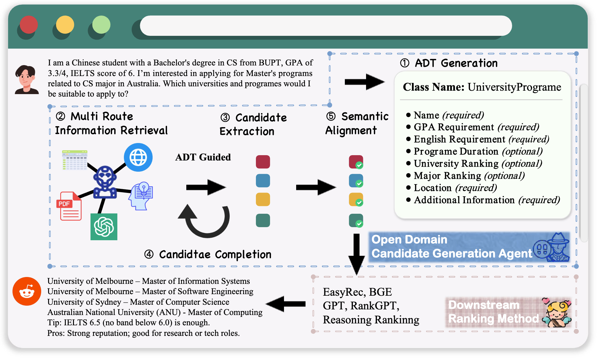

# OCG Agent 🌟
**We introduce the Open Candidate Generation Agent, a deep‐research–oriented information retrieval module designed to retrieve structured candidates both comprehensively and in depth. Its goal is to assemble a high‐quality, sufficiently large candidate set that can effectively support the downstream recommendation pipeline.**  

## Introduction 🌟
Narrative-driven recommendation queries are common on QA platforms, AI search engines, and social forums, but traditional RAG approaches struggle with information loss in long, fragmented contexts and suboptimal ranking. We introduce a novel retrieve–rank paradigm and show its theoretical advantages over RAG. At its core is OCG-Agent, which specially focus on the information retrieval stage, generatively retrieves structurally adaptive, semantically aligned candidates to ensure broad coverage and high information quality. Experiments on real-world Reddit and corporate education-consulting datasets demonstrate the effectiveness of our approach, and ablation studies confirm the design choices of each OCG-Agent component.

<div align="center">
  
  <br>
  <em>OCG-Agent in Narrative-driven Recommendation Task.</em>
</div>

## Key Module ✨

#### 📝 ADT Generation
ADT Generation maps each user narrative query into a unified, structured candidate template—incorporating both required and optional attributes (at minimum a unique Name identifier and an extensible AdditionalInformation field)—by means of chain-of-thought prompting.

#### 🌐 Multi-Route Information Retrieval
Multi-Route Information Retrieval concurrently invokes four complementary retrieval channels—web search, vector search, structured querying, and generative LLM—to efficiently aggregate a large-scale, high-coverage candidate set from heterogeneous data sources.


#### 🔍 Candidate Extraction
LLMs are deployed in parallel to extract candidates from each retrieval fragment, perform deduplication and aggregation, and merge complementary attributes for identical candidates across fragments, thus yielding a consistent, information-rich candidate pool.

#### 🔄 Reflective Completion for Attributes
Reflective Completion automatically detects any missing required fields within each candidate and, for each absent attribute, initiates a targeted retrieval augmented by chain-of-thought prompting, iteratively filling in all necessary information until the candidate is complete.

#### 💡 Expert-Guided Semantic Normalisation
For all semantically sensitive attributes in the completed candidates (e.g., differing GPA scales across countries), the system employs chain-of-thought prompting—supplemented by human expert knowledge such as conversion rules and policy tables—to normalize these values into standardized, cross-domain comparable metrics.


## Experimental Setup 🛠️
### Datasets
We conduct experiments on two datasets chosen to mirror the *coverage* and *semantic-richness* deficiencies.

*Reddit MovieSuggestions benchmark*:Originally released by Eberhard et al. (2019) and later reused by Eberhard et al. (2025). 

*AusEdu-Narratives*: Corpus consisting of 30 anonymised, real-world study-abroad counselling cases supplied by a local consultancy.

### Evaluation
We measure Precision@k, Recall@k, and NDCG@k, (k = 10 for movies, 5 for education).
For each query, the OCG-Agent retriever runs once, after which RankGPT plays as re-ranker run for three times and we report the averaged value.

### Baselines
We choose RankGPT as the ranking method, and OCG-RankGPT is our main implementation. We also have a baseline variant implemented by retrieve-read paradigm under the same external knowledge usage for fair comparison. Additionally, we further compare with the following categories of baselines:

*LLM Direct:* GPT4o-mini, GPT4o and DeepSeek-R1.

*AI Search Engines:* Perplexity, GPT-AI Search, and Gemini Search.

*Deep Research:* Perplexity and Open Deep Research.

## Results 📊 （手打的表格和图片哪个好？你选一个另一个我就删了）

| Method                   | Movie<br>Precision\@10                                                                                         | Movie<br>Recall\@10 | Movie<br>NDCG\@10 | Education<br>Precision\@5 | Education<br>Recall\@5 | Education<br>NDCG\@5 |
| ------------------------ | -------------------------------------------------------------------------------------------------------------- | ------------------- | ----------------- | ------------------------- | ---------------------- | -------------------- |
| GPT4o-mini               | 0.2800                                                                                                         | 0.1291              | 0.3003            | 0.2545                    | 0.1682                 | 0.3236               |
| GPT4o                    | 0.3133                                                                                                         | 0.1506              | 0.3451            | 0.3318                    | 0.2617                 | 0.3829               |
| DeepSeek-R1              | 0.2767                                                                                                         | 0.1254              | 0.3068            | 0.3463                    | 0.2712                 | 0.3939               |
| AISearch-Perplexity      | 0.1500                                                                                                         | 0.0705              | 0.1486            | 0.3473                    | 0.2349                 | 0.4519               |
| AISearch-GPT             | 0.2200                                                                                                         | 0.0959              | 0.2531            | 0.3272                    | 0.2227                 | 0.4207               |
| AISearch-Gemini          | 0.1967                                                                                                         | 0.0918              | 0.2180            | 0.3090                    | 0.2041                 | 0.4074               |
| Open Deep Research       | 0.0931                                                                                                         | 0.0384              | 0.0804            | 0.2545                    | 0.1650                 | 0.3109               |
| Perplexity Deep Research | 0.2033                                                                                                         | 0.0876              | 0.2246            | 0.3090                    | 0.2015                 | 0.3423               |
| Retrieve-then-Read       | 0.3143                                                                                                         | 0.1520              | 0.3324            | 0.3739                    | 0.3073                 | 0.5216               |
| OCG-RankGPT              | **0.3567**                                                                                                     | **0.1832**          | **0.3940**        | **0.5342**                | **0.4323**             | **0.6641**           |


## Project Code Structure 🏗️ 

----- OCG-Agent/

    └─── core/                  # Core module of OCG (ADT Generation, Multi-Route Information Retrieval, etc.)
    │    ├─── ocg_agent.py      # Main process pipeline
    │    ├─── QA.py             # Q&A and recommendation core logic (Rewrite, etc.)
    │    └─── prompt.py         # Prompt loading tools
    ├─── dataset/               # Movie dataset folder
    │    └─── OCG-Agent/dataset/movie_296.json
    ├─── image/                 # Image resource folder
    ├─── model/                 # Model version
    ├─── prompt/                # Project prompts folder
    ├─── rerank/                # Reranking Module
    │    ├─── model.py          # Define the interface and implementation of the LLM rerank model
    │    ├─── rank.py           # Evaluation and sorting main processEvaluation and sorting main 
    │    └─── rank.sh           # Sorting Script
    ├─── tool/                  # Tool Module
    │    ├─── AISearch.py       # AI search tools (SerperSearch, etc.)
    │    ├─── Docling.py        # Document and web page content reading tool
    ├─── utils/                 # General utility functions
    │    └─── utils.py          # Tools (API calls, dialogue generation systems and recommendation systems)
    ├─── README.md
    ├─── requirements.txt
    ├─── config.py              # Load and manage environment variables required by the project
    ├─── retrieval.py           # Candidate generation (retrieval) main process
    ├─── retrieval.sh           # Retrieve process the startup shell script
    ├─── .gitignore
    ├─── .DS_Store
    └─── .git/                  # Git version control file


## Getting Started 🚀 （源自readme原来的内容。你检查一下）

### 1. Clone the repository:

```bash
git clone https://github.com/Ancientshi/OCG-Agent.git
cd OCG-Agent
```

### 2. Setup API Key
Create `.env` file, we provide the `.env.example`, the `OPENAI_API_KEY` and `SERPER_SEARCH_KEY` is necessary.

### 3. Install Dependencies

```bash
# Create and activate virtual environment
python -m venv .venv
source .venv/bin/activate  # Linux/Mac
.venv\Scripts\activate     # Windows

# Install dependencies
pip install -r requirements.txt
```
### 4. Clone the [Docling](https://github.com/docling-project/docling)

Docling should be deployed as a Flask application, enabling OCG-Agent to access it through a local API and retrieve web content.

### 5. Run
`bash retrieval.sh`, the generated candiddates will be stored in `./AI_search_content/movie_296`.